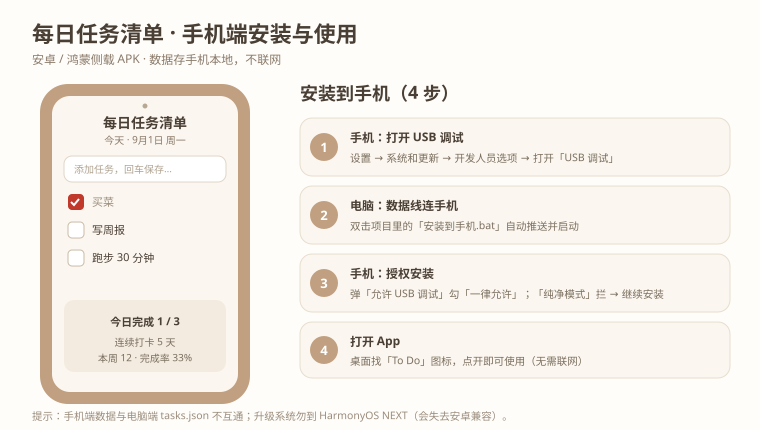

# 每日任务清单 (Daily Todo List)

> 版本：**v1.2.0** —— 在 v1.1 之上新增**手机端（安卓 / 鸿蒙 APK）**；桌面端零依赖、本机运行不变。

一个本机运行的轻量级每日任务清单应用。后端仅使用 Python 3 标准库（**零第三方依赖**），
前端为原生 HTML/JS，任务数据保存在本地 `tasks.json`。

👉 第一次用？看 [快速上手（3 分钟）](QUICKSTART.md)。

## 特性
- 每日视图：任务归属到具体日期，首页默认「今天」；顶部日期导航可前后翻看任意历史日期
- 新增任务只能加到「今天」；历史日期可勾选完成 / 编辑内容 / 删除，但不能往回新增
- 过期未完成任务留在原日期、不顺延，靠日期切换查看历史
- 统计与打卡回顾：今日完成/总数、本周完成、连续打卡天数、今日完成率、近 7 天完成趋势图（纯 SVG）
- 点任务文字就地编辑（回车保存 / Esc 取消）
- 任务的增删改查（CRUD）
- 本机单机运行，监听 `127.0.0.1:8000`，无需登录鉴权
- 数据以 UTF-8 原子写入本地文件，安全持久化
- **每次改动自动备份**到 `backup/` 目录（保留最近 30 份），导入前还会额外备份，防误删/损坏
- 零依赖，开箱即用

## 运行方式

方式一（推荐，Windows 无黑框启动）：
双击 `start.bat`（或 `start.vbs`）。首次使用请双击 `install_desktop_icon.vbs` 生成桌面图标。

方式二（命令行）：
```bash
python app.py
```
然后浏览器打开 http://127.0.0.1:8000/

## 手机端（Android / 鸿蒙系统安卓 APK）

同一套前端代码、两种存储后端：电脑端走 Python 后端，手机端走 App 内本地存储（不联网）。
当前可产出 **debug APK**，支持安卓及鸿蒙系统（HarmonyOS 4.x，需保持安卓 APK 兼容，切勿升级到 HarmonyOS NEXT）。

📦 **安装包（APK）已发布在 GitHub Release**：<https://github.com/zby-dsb/new-todolist/releases/tag/v1.2.0>
不想自己打包的话，用手机浏览器打开该链接，下载 `DailyTodo-v1.0-debug.apk` 后允许「未知来源」安装即可（侧载）。



### 安装到手机（推荐：一键脚本）
1. 手机用**数据线**连上电脑，并在「设置 → 系统和更新 → 开发人员选项」打开 **USB 调试**；
   把「USB 连接方式」设为「传输文件」。
2. 双击项目里的 `安装到手机.bat`。
3. 若手机弹「允许 USB 调试」→ 勾选「一律允许」并点确定；若弹出「纯净模式」拦截 → 点「继续安装」。
4. 装完去桌面找 **「To Do」** 图标即可打开。

> 命令行方式：`D:\Android\Sdk\platform-tools\adb.exe install -r dist\每日任务清单-v1.0-debug.apk`

### 重新打包
修改前端后，双击 `打包.bat`（会执行 `cap sync` + Gradle 构建，产物输出到 `dist/`）。
环境要求见 `docs/技术方案_手机端_v1.0.md`：**JDK 21**（D:\Android\JDK21）、Android SDK（D:\Android\Sdk）、
Gradle（已本地化到 D:\Android\gradle-dists，wrapper 走 `file:///`）。

## 目录结构
- `app.py` —— 后端服务（标准库 HTTP 服务 + 接口 + 自动备份 + 统计）
- `static/index.html` —— 前端页面（米色 UI · 每日视图 · 统计面板 · 就地编辑）
- `demo/` —— 前期可视化原型（已归档到 `demo/archive/`，仅作界面参考，不参与运行）；当前可运行原型见 `demo/mobile_v1_demo.html`
- `docs/` —— 设计文档与技术方案（`DESIGN_v1.1.md` / `技术方案_v1.1.md` 等）
- `tests/` —— 单元测试 + 接口冒烟测试
- `tasks.json` —— 本地数据（运行态，不纳入版本库）
- `backup/` —— 每次改动的自动备份（运行态，不纳入版本库）

## 接口概览
| 方法 | 路径 | 说明 |
|------|------|------|
| GET  | `/api/tasks?date=YYYY-MM-DD` | 列出某天任务（缺省今天），返回 today / viewed |
| POST | `/api/tasks` | 新增任务（强制归属今天） |
| POST | `/api/tasks/{id}/toggle` | 切换完成状态（写/清 completed_at） |
| PUT  | `/api/tasks/{id}` | 编辑任务内容（日期不变） |
| DELETE | `/api/tasks/{id}` | 删除任务 |
| GET  | `/api/stats` | 统计与打卡回顾 |
| GET  | `/api/export` | 导出 json 下载 |
| POST | `/api/import` | 先自动备份再覆盖导入 |

## 说明
仓库已通过 `.gitignore` 排除运行态文件（`tasks.json`、`app.log`、`server.pid`、`app.url`、`backup/` 等），
只保留源码、资源与文档。
